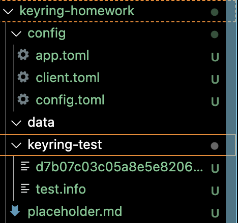

Goal: 
* Learners should understand how to create a keyring
* Learners should understand how to store a keyring in difference places

# Lesson 2: Keyring

An user needs a blockchain address to:
* store their crypto asset
* sign transaction

Keyring is where accounts are stored on CLI
* single account (baby14567...) (scope of this video)
* multisig account (self - exploration)

Keyring backend storage exact location is determined by:
* flag --keyring-backend: the place where addresses will be stored
* flag --home: the place where keyring will be stored

## Guidelines
1. add
 * new: babyd keys add test-key
 * recover: babyd keys add test-key --recover
2. delete: babyd keys delete test-key
3. list: babyd keys list
4. show
 * address: babyd keys show test-key -a
 * pubkey: babyd keys show test-key -p

## Help videos
1. https://youtu.be/QUXToHMl65A

## Homework
1. add key "test" to keyring-backend test
2. query key "test" from keyring-backend os (should found nothing)
3. add key "test" to home ["homework/keyring-homework"](../../homework/keyring-homework/placeholder.md) with keyring-backend test

