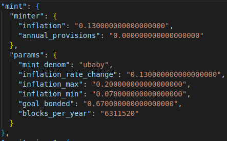
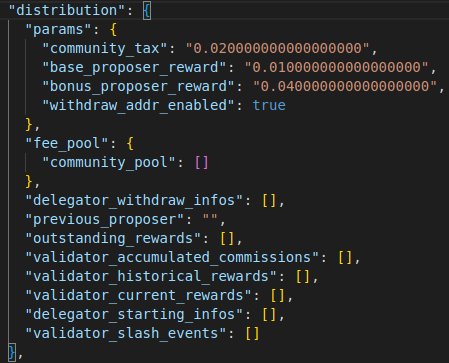
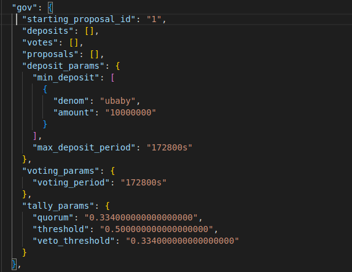

Goal: 
*  Learner should understand three fields in genesis.json (mint, distribution, gov)
*  Learner can check reward balances for validator address

# Lesson 13: Dive deeper into app_state module configuration (mint, distribution, gov)

In this lesson, I will talk about three fields in app_state (mint, distribution, gov) in genesis.json.

* mint: allow for a flexible inflation rate determined by market demand targeting a particular bonded-stake ratio and effect a balance between market liquidity and staked supply.
* distribution: describes a functional way to passively distribute rewards between validators and delegators 
* gov: handles all governance-related transactions 



1. In this 'mint' field:

```bash
 "minter": {
        "inflation": "0.130000000000000000",
        "annual_provisions": "0.000000000000000000"
 }
```
* inflation: initial yearly percentage of increase in the total supply of staking token, compounded weekly. A 0.130000000000000000 value means the target is 13% yearly inflation
* annual_provisions: calculated each block. Initialize at 0.000000000000000000

``` bash 
"params": {
        "mint_denom": "ubaby",
        "inflation_rate_change": "0.130000000000000000",
        "inflation_max": "0.200000000000000000",
        "inflation_min": "0.070000000000000000",
        "goal_bonded": "0.670000000000000000",
        "blocks_per_year": "6311520"
 }u
```
* mint_denom: Denom of the staking token
* inflation_rate_change: max yearly change in inflation
* inflation_max: maximum level of inflation
* inflation_min: minium level of inflation
* goal_bonded: percentage of the total supply that is targeted to be bonded. If the percentage of bonded staking tokens is below this target, the inflation increases (following inflation_rate_change) until it reaches inflation_max. If the percentage of bonded staking tokens is above this target, the inflation decreases (following inflation_rate_change) until it reaches inflation_min
* blocks_per_year: estimation of the amount of blocks per year. Used to compute the block reward coming from inflated staking token (called block provisions).

And you can read and practice, you can try the module at https://github.com/cosmos/cosmos-sdk/tree/main/x/mint



2. In this 'distribution' field:

```bash
"params": {
        "community_tax": "0.020000000000000000",
        "base_proposer_reward": "0.010000000000000000",
        "bonus_proposer_reward": "0.040000000000000000",
        "withdraw_addr_enabled": true
 }
```
* community_tax: The tax percentage on fees and block rewards that goes to the community pool
* base_proposer_reward: Base bonus on transaction fees collected in a valid block that goes to the proposer of block. If value is 0.010000000000000000, 1% of the fees go to the proposer
* bonus_proposer_reward: Max bonus on transaction fees collected in a valid block that goes to the proposer of block. The bonus depends on the number of precommits the proposer includes. If the proposer includes 2/3rd precommits weighted by voting power (minimum for the block to be valid), they get a bonus of base_proposer_reward. This bonus increases linearly up to bonus_proposer_reward if the proposer includes 100% of precommits
* withdraw_addr_enabled: If true, delegators can set a different address to withdraw their rewards. Set to false if you want to disable transfers at genesis, as it can be used as a way to get around the restriction.

Command allows users to query validator commission rewards by address:
```bash
babyd query distribution commission [address] [flags]
```
*note: address not bech32 format. format use this case (babyvaloper...)

And you can read and practice, you can try the module at https://github.com/cosmos/cosmos-sdk/tree/main/x/distribution



3. In this 'gov' field:

```bash
      "starting_proposal_id": "1",
      "deposits": [],
      "votes": [],
      "proposals": [],
```
* starting_proposal_id: This parameter defines the ID of the first proposal. Each proposal is identified by a unique ID.
* deposits: List of deposits for each proposal ID. Set to null if genesis was not exported from previous state.
* votes: List of votes for each proposal ID. Set to null if genesis was not exported from previous state.
* proposals: List of proposals for each proposal ID: Set to null if genesis was not exported from previous state.

```bash
"deposit_params": {
        "min_deposit": [
          {
            "denom": "ubaby",
            "amount": "10000000"
          }
        ],
        "max_deposit_period": "172800s"
}
```
* min_deposit: The minimum deposit required for the proposal to enter Voting Period. If multiple denoms are provided, the OR operator applies.
* max_deposit_period: The maximum period (in nanoseconds) after which it is not possible to deposit on the proposal anymore.

```bash
"voting_params": {
    "voting_period": "172800s"
}
```
* voting_period: Length of the voting period.

```bash
"tally_params": {
    "quorum": "0.334000000000000000",
    "threshold": "0.500000000000000000",
    "veto_threshold": "0.334000000000000000"
}
```
* quorum: Minimum percentage of bonded staking tokens that needs to vote for the result to be valid.
* threshold: Minimum percentage of votes that need to be YES for the result to be valid.
* veto_threshold: Maximum percentage NO_WITH_VETO votes for the result to be valid.

And you can read and practice, you can try the module at https://github.com/cosmos/cosmos-sdk/tree/main/x/gov


## Guidelines

1. initialize a node with field denom in gov = udaddy 
```bash
cat $HOME/.baby/config/genesis.json | jq '.app_state["gov"]["deposit_params"]["min_deposit"][0]["denom"]="udaddy"' > $HOME/.baby/config/tmp_genesis.json && mv $HOME/.baby/config/tmp_genesis.json $HOME/.baby/config/genesis.json
```
2. check genesis.json in ~/.baby/config/genesis.json. gov field should be denom=udaddy


3. Run the network
```bash 
scripts/test-node-deploy.sh --continue
```

## Homework
1. Deploy a node with field denom in mint = udaddy successfully


2. Query validator commission rewards successfully

